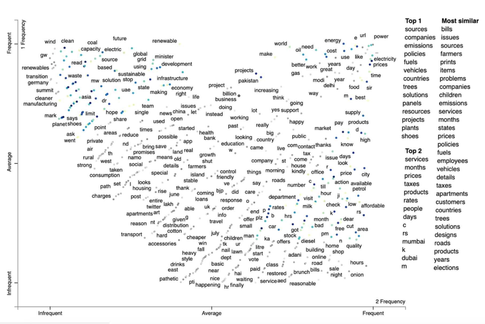
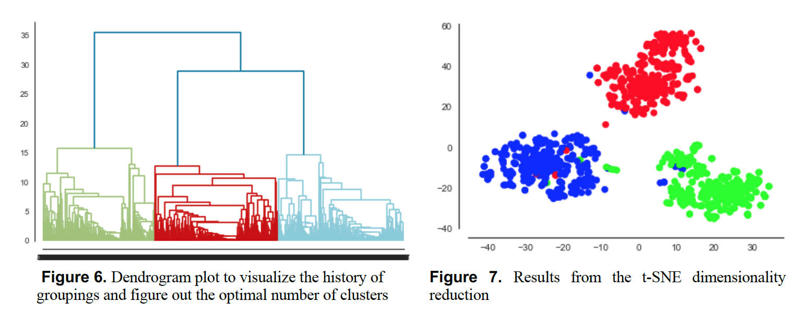
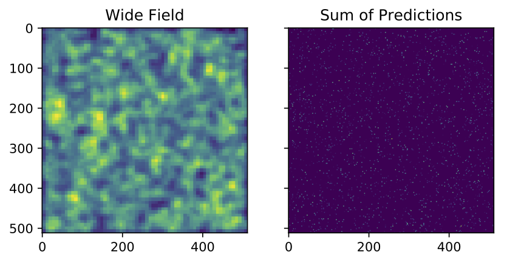
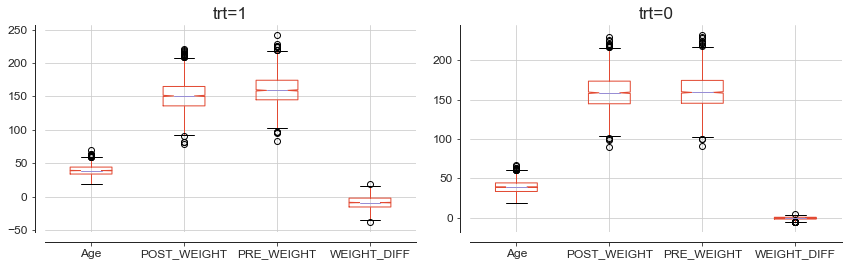

# Mahzad Khoshlessan

## Welcome to My Portfolio

This repository contains some of my projects in Python and R. They vary in subject and scope and cover Bayesian statistics, data engineering, Deep learning, tatistical analysis, machine learning, data acquisition, data cleaning, data exploration, and data visuzalition. If you have any questions or feedback about any of my projects (data sources, inspiration, critiques) please contact me at mahzadkhoshlessan@gmail.com.

### [Computer Pointer Controller (OpenVino Toolkit)](https://github.com/mkhoshle/IntelEdgeAI-Projects/blob/master/Computer-Pointer-Controller/starter/README.md) 
In this project, I use a gaze detection model to control the mouse pointer of my computer. I use the Gaze Estimation model to estimate the gaze of the user's eyes and change the mouse pointer position accordingly. This project will require running multiple models in the same machine and coordinating the flow of data between those models.

### [Deploy a People Counter App at the Edge](https://github.com/mkhoshle/IntelEdgeAI-Projects/tree/master/People-Counter)
The people counter application will demonstrate how to create a smart video IoT solution using Intel® hardware and software tools. The app will detect people in a designated area, providing the number of people in the frame, average duration of people in frame, and total count.

### [Build a Smart Queue APP for Three Different Scenarios (Choosing the right hardware)](https://github.com/mkhoshle/IntelEdgeAI-Projects/tree/master/Smart-Queuing-System)
There are three scenarios which involve people in queues, but each scenario will require different hardware. Thus, in this project I first determine which hardware might work for each scenario—and then explain my initial choice in a proposal document ([here](https://github.com/mkhoshle/IntelEdgeAI-Projects/blob/master/Smart-Queuing-System/choose-the-right-hardware-proposal-template.pdf)). Then, after I've built and tested my application on each hardware device for all three scenarios, I'll review the results and validate or update my initial proposed choices in the proposal document.

### [AI for Energy: Using NLP to Find Barriers to Humanizing Energy Transition](https://github.com/mkhoshle/AI-for-Energy)
The philosophy behind this project is to find ways that governments can benefit from to involve
people in accelerating energy transition and taking advantage of sustainable energy
resources. In fact, people play an important role besides state-of-the-art technologies and
business boosters. How could we get these insights? I used NLP to answer this question.

### [Parallel Analysis of Molecular Dynamic Trajectories](https://github.com/mkhoshle/paper-hpc-py-parallel-mdanalysis)
Paper draft investigating approaches to increase the performance of analysing MD trajectories with Python on HPC resources. 

#### [Supplement Information](https://github.com/mkhoshle/supplement-hpc-py-parallel-mdanalysis)
Supplementary material (scripts and documentation) for the paper Parallel Performance of Molecular Dynamics Trajectory Analysis, available at https://onlinelibrary.wiley.com/doi/abs/10.1002/cpe.5789.

### [Molecular Counting & Single Molecule Localization Microscopy in Living Cells Using Deep-Learning](https://github.com/mkhoshle/PORTFOLIO/tree/master/Molecular-Counting)
In this project, I employed a deep convolutional neural network to quantify the number of particles in a region of interest. I implemented a pre-trained neural network and parallelized the model on GPU. The deep convolutional neural network was able to overcome important theoretical challenges arises from the complex photo-physics of fluorescent molecules and gain acceptable accuracy up to a density of 6 [emitter/m2].

### [Bayesian Nonparametric Approach for Reliable Molecular Counting in Living Cells](https://github.com/mkhoshle/PORTFOLIO/tree/master/Counting-Bayesian-statistics)
In this project, I employed stochastic models (Monte Carlo methods, Hidden Markov Models) for parameter learning from the data with application to physical and biological sciences. I built a Bayesian non-parametric model for counting number of molecules on top of the cell by analyzing images from super-resolution microscopy. 

SMLM is used to visualize small biological structures. In SMLM, all proteins are labeled with photo activatable fluorescent proteins (PA-FPs) and are expressed in their native amount. When they are exposed to light they photo-convert and emit lights stochatically through time. Then by repeatedly imaging a small random subset of fluorescent molecules in the sample, images with sparse support can be created and thereby allows extremely high accuracy in determining the locations of the molecules. I first built a Bayesian nonparametric model for this purpose. The method worked fine for high signal to noise ratios cases. However, the method was underestimating the number of molecules under challenging signal-to-noise conditions and high emitter densities.

### [Clinical Trial Data](https://github.com/mkhoshle/PORTFOLIO/tree/master/Clinical_trial_data)
A researcher needs your statistical expertise to evaluate an intervention. The six-month intervention was to give subjects a special exercise plan. The researcher randomized 2,500 people to the treatment group (which receives the intervention) and another 2,500 to the control group (does not receive the intervention).  The physician wishes to evaluate the subjects’ health outcomes (weight and self-rated health) before the start of the intervention and immediately after the intervention. The physician wants to know whether the new exercise plan will affect one’s overall health (measured by change in weight and self-rated health) differently for those receiving the new exercise plan versus those not receiving the exercise plan.

### [Data Engineering project](https://github.com/mkhoshle/Consumer-Complaints)
The federal government provides a way for consumers to file complaints against companies regarding different financial products, such as payment problems with a credit card or debt collection tactics. This challenge will be about identifying the number of complaints filed and how they're spread across different companies. For this challenge, we want to know for each financial product and year, the total number of complaints, number of companies receiving a complaint, and the highest percentage of complaints directed at a single company.

